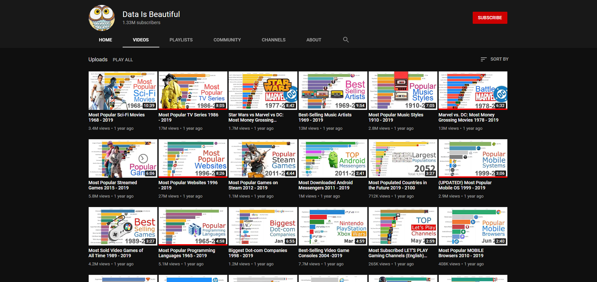

# youtube_channel_scrapper
Scrape a youtube channel you want and get a csv file with video title, link, current amount of views and posted date.

## Resources Used 
**Python Version:** 3.7 

**Packages:** bs4, pandas, selenium 

## Instructions
* First make sure you have latest version of chromedriver installed on your machine and change PATH variable to your path.
* Pick a YouTube channel you need and open a page with video as shown below, then copy url and pass in url variable.

* You can change a name for your csv file.
* Start the programm and wait untill it scrolls to the end of the page to get html code from the whole videos page.
